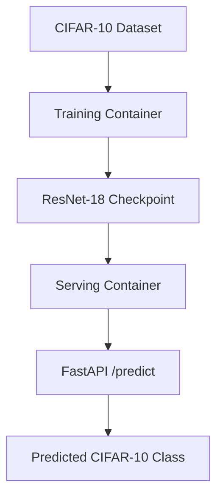

# mlops-pytorch-pipeline

A containerized CIFAR-10 image classification pipeline using
PyTorch ResNet-18, with separate training and serving images.

## Architecture diagram

```mermaid
flowchart TD
    A[CIFAR-10 Dataset] --> B[Training Container]
    B --> C[ResNet-18 Checkpoint]
    C --> D[Serving Container]
    D --> E[FastAPI /predict]
    E --> F[Predicted CIFAR-10 Class]
```
