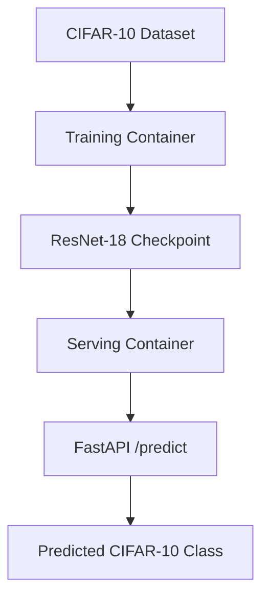

# mlops-pytorch-pipeline

A containerized CIFAR-10 image classification pipeline using
PyTorch ResNet-18, with separate training and serving images.

## 1. Architecture diagram


## 2. Setup Instructions
### Prerequisites:
```
Python 3.11+
Docker Desktop
Git
```

### Local Environment:
```
python -m venv .venv
.venv\Scripts\Activate.ps1
pip install -r ...
```

### Build Training Image:
```
docker build -f docker/Dockerfile.train -t mlops-train:v1 .
```

### Run training:
```
docker run --rm 
  -v "${PWD}\data:/app/data" 
  -v "${PWD}\checkpoints:/app/checkpoints" 
  -v "${PWD}\configs:/app/configs" 
  -e TRAINING_CONFIG=/app/configs/training_config.yaml 
  mlops-train:v1
```

### Build serving image:
```
docker build -f docker/Dockerfile.serve -t mlops-serve:v1 .
```

### Run serving:
```
docker run --rm -d 
  --name mlops-serve 
  -p 8080:8080 
  -v "${PWD}\checkpoints:/app/checkpoints" 
  mlops-serve:v1
```

### Health:
```
curl.exe http://localhost:8080/health
```

### Predict:
```
curl.exe -X POST http://localhost:8080/predict -F "image=@tests\test_img.jpg"
```

#### Expected Output: 
```
{
"predicted_class":"automobile",
"predicted_class_index":1,
"probabilities":
    {
        "airplane":0.000688,
        "automobile":0.995032,
        "bird":2.8e-05,
        "cat":7e-06,
        "deer":5.4e-05,
        "dog":4e-06,
        "frog":1.6e-05,
        "horse":1.5e-05,
        "ship":0.000136,
        "truck":0.004021
    }
}
```
