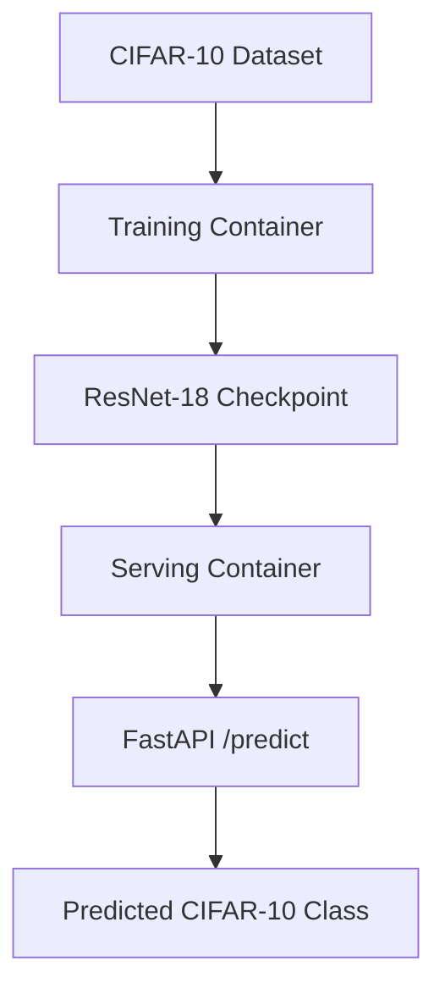

# MLOps PyTorch Pipeline

A containerized CIFAR-10 image classification pipeline using PyTorch ResNet-18, with separate training and serving images with a FastAPI serving layer.

> Course: DA5402W MLOps - Assignment 3

> Author: Kasar Nikhil Shantaram (DA25M515) | GitHub: [@nikhilkasar98](https://github.com/nikhilkasar98)

## Architecture diagram



## Project Structure

```
mlops-pytorch-pipeline/
├── README.md
├── .gitignore
├── .github/workflows/ci.yml
├── src/
│   ├── train.py          # Training loop with early stopping
│   ├── model.py           # ResNet-18 (torchvision) for CIFAR-10
│   ├── dataset.py          # CIFAR-10 loading, transforms, DataLoaders
│   └── serve.py            # FastAPI app: POST /predict, GET /health
├── configs/
│   └── training_config.yaml
├── docker/
│   ├── Dockerfile.train
│   └── Dockerfile.serve
├── k8s/
│   ├── namespace.yaml
│   ├── configmap.yaml
│   ├── training-job.yaml
│   ├── serving-deployment.yaml
│   ├── serving-service.yaml
│   └── hpa.yaml
├── requirements/
│   ├── train.txt
│   └── serve.txt
└── tests/
    └── test_model.py
```

## Setup Instructions
### Prerequisites:
```
Python 3.11+
Docker Desktop
Git
```

### Local Environment:
```bash
python -m venv .venv
.venv\Scripts\Activate.ps1

# Install dependencies
pip install -r requirements/train.txt

# Run training locally
python src/train.py

# Run the serving API locally
pip install -r requirements/serve.txt
uvicorn src.serve:app --host 0.0.0.0 --port 8080
```

### Build Training Image:
```bash
docker build -f docker/Dockerfile.train -t mlops-train:v1 .
```

### Run training:
```bash
docker run --rm 
  -v "${PWD}\data:/app/data" 
  -v "${PWD}\checkpoints:/app/checkpoints" 
  -v "${PWD}\configs:/app/configs" 
  -e TRAINING_CONFIG=/app/configs/training_config.yaml 
  mlops-train:v1
```

### Build serving image:
```
docker build -f docker/Dockerfile.serve -t mlops-serve:v1 .
```

### Run serving:
```
docker run --rm -d 
  --name mlops-serve 
  -p 8080:8080 
  -v "${PWD}\checkpoints:/app/checkpoints" 
  mlops-serve:v1

> 26bbc7fdf8cfd50418f78855afbbf63553edb17665b3209b90c880127ffc133e
```

### Health:
```
curl.exe http://localhost:8080/health

> {"status":"healthy","model_loaded":true}
```

### Predict:
```
curl.exe -X POST http://localhost:8080/predict -F "image=@tests\test_img.jpg"
```

#### Output: 
```
{
"predicted_class":"automobile",
"predicted_class_index":1,
"probabilities":
    {
        "airplane":0.000688,
        "automobile":0.995032,
        "bird":2.8e-05,
        "cat":7e-06,
        "deer":5.4e-05,
        "dog":4e-06,
        "frog":1.6e-05,
        "horse":1.5e-05,
        "ship":0.000136,
        "truck":0.004021
    }
}
```


## Resources

- [Docker Best Practices for Python](https://docs.docker.com/language/python/)
- [Kubernetes Jobs Documentation](https://kubernetes.io/docs/concepts/workloads/controllers/job/)
- [PyTorch Deployment with TorchServe](https://pytorch.org/serve/)
- [Conventional Commits](https://www.conventionalcommits.org/)
